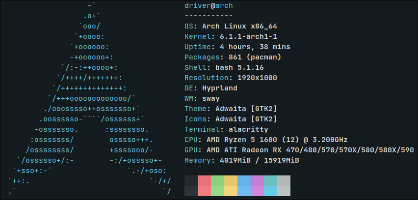
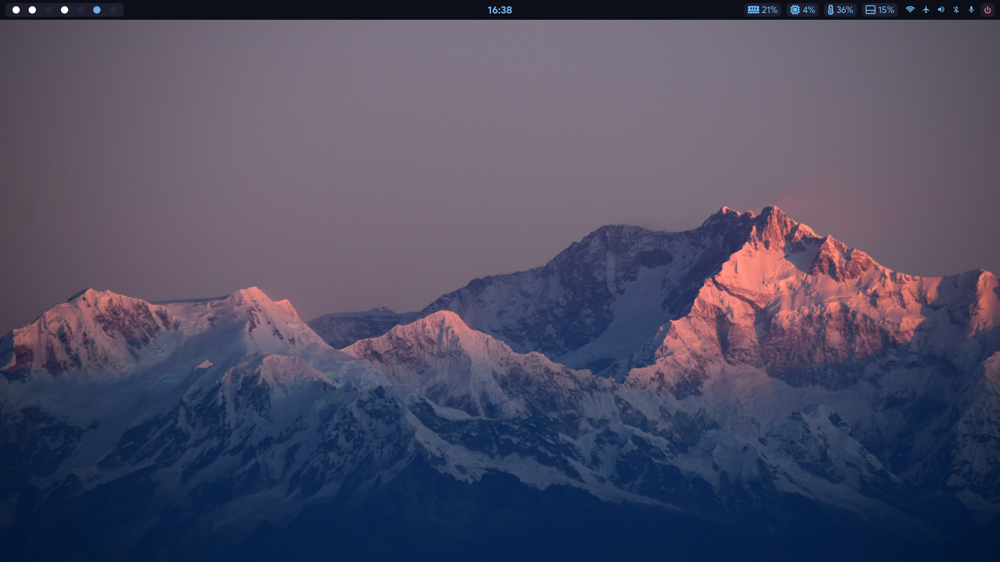
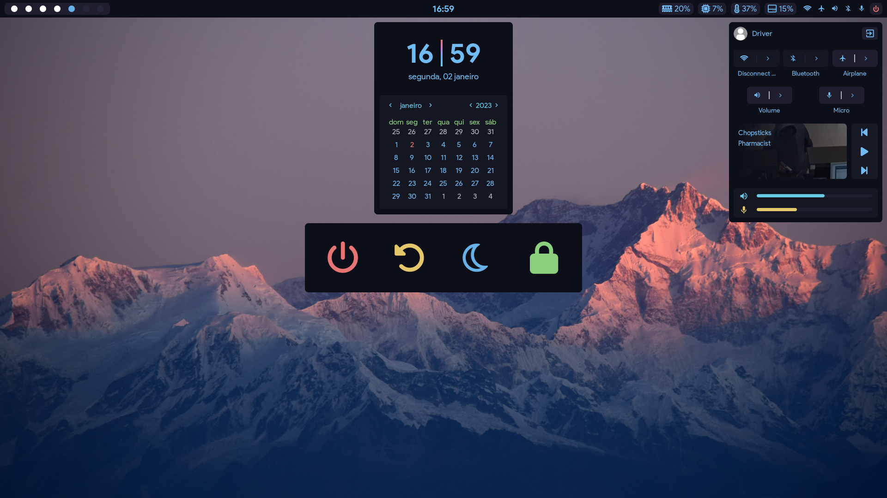
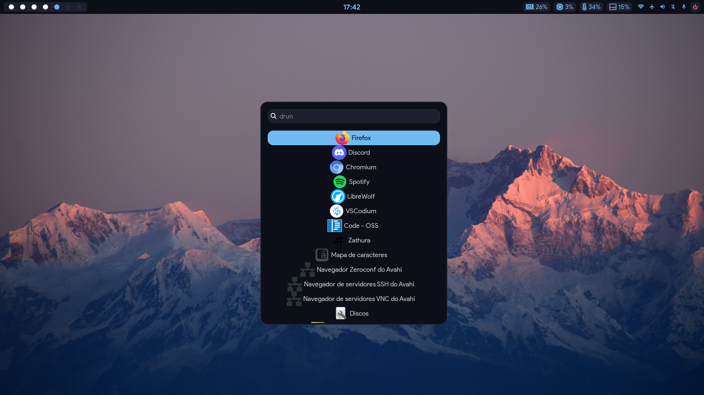

# dotfiles

My first dotfiles on wayland.
Thanks to [AlphaTechnolog](https://github.com/AlphaTechnolog), [rxyhn](https://github.com/rxyhn) and all the rice developers which inspired me.


## Information

### <samp>Neofetch </samp>



### <samp>Colors based on [Everblush](https://github.com/Everblush) theme</samp>

### <samp>Requirements</samp>
#### <samp>YAY:</samp>

```
git
go
```
```
git clone https://aur.archlinux.org/yay.git
cd yay | makepkg -si
```

#### <samp>Fonts:</samp>


```
noto-fonts-emoji
tft-font-awewsome
tft-roboto
ttc-iosevka
ttf-jetbrains-mono
ttf-nerd-fonts-symbols-1000-em
ttf-sourcecodepro-nerd
```

```
yay -S noto-fonts-emoji tft-font-awewsome tft-roboto ttc-iosevka ttf-jetbrains-mono ttf-nerd-fonts-symbols-1000-em ttf-sourcecodepro-nerd
```

#### <samp>Hyprland:</samp>

```
bluetoothctl
grim
hyprland-git
hyprpicker-git
mako
pactl
playerctl
slurp
socat
swaybg
swayidle
swaylock-effects-git
wl-clipboard
wlogout
wofi
xdg-desktop-portal-hyprland-git
xdg-desktop-portal-wlr
xdg-user-dirs
```
```
yay -S bluetoothctl grim hyprland-git hyprpicker-git mako pactl playerctl slurp socat swaybg swayidle swaylock-effects-git wl-clipboard wlogout wofi xdg-desktop-portal-hyprland-git xdg-desktop-portal-wlr xdg-user-dirs
```

#### <samp>Spotify:</samp>


```
spotify
spotifywm-git
```
```
yay -S spotify spotifywm-git
```

#### <samp>EWW:</samp>


```
rustup
```
```
yay -S rustup
rustup install nightly
git clone https://github.com/elkowar/eww
cd eww | cargo build --release --no-default-features --features=wayland | cd target/release | chmod +x ./eww | sudo mv ./eww /usr/bin/
```


## Galery





